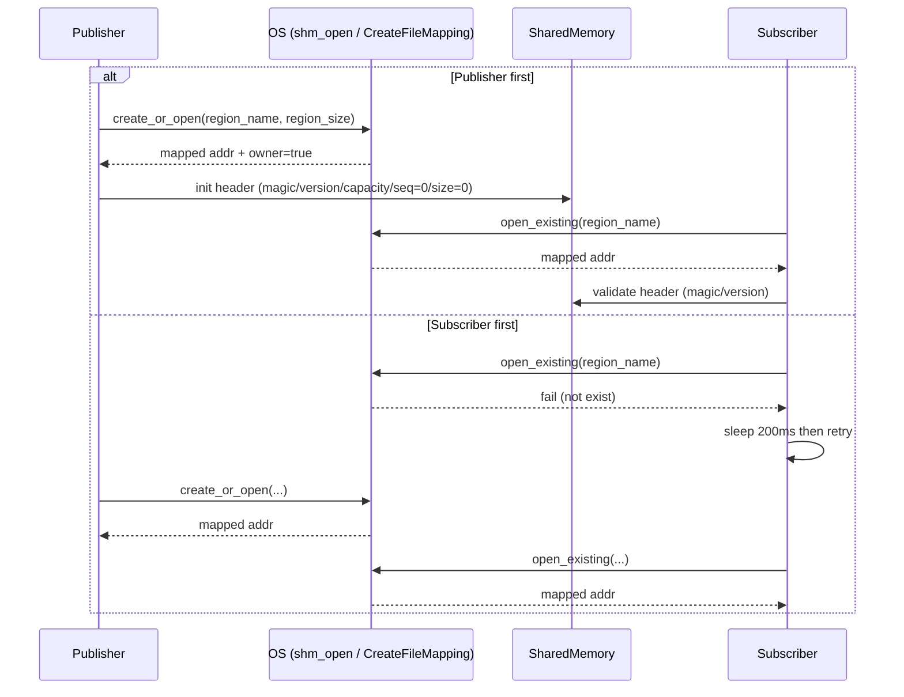
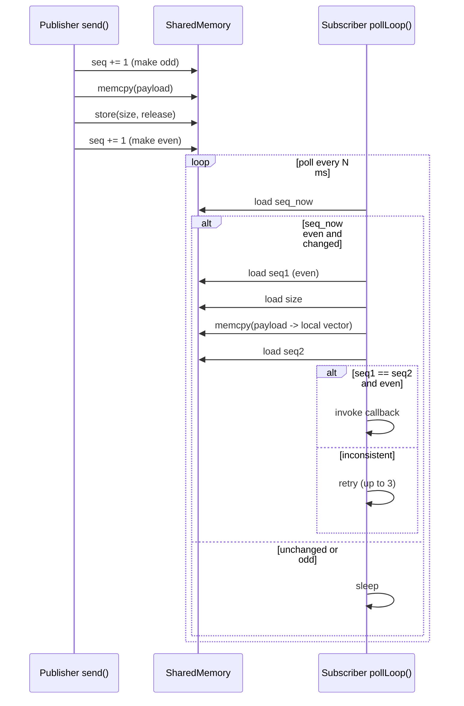

# shm_pubsub：当前实现原理、时序与丢帧优化思路

本文基于仓库当前实现整理 `shm_pubsub` 的工作原理，并给出时序图与若要“尽量不丢帧/不丢消息”的优化方向（重点：使用 ring buffer 作为共享内存队列，并支持一个 topic 多个 subscriber）。

## 1. 当前 shm_pubsub 做的事情（结论先行）

当前实现（`k_version=2`）是 **“单共享内存区 + ring buffer（多槽队列）+ 多 subscriber 游标表”** 的模型：

- 每个 topic 对应一个共享内存 region（名字由 topic 派生），见 `shm_pubsub/src/shm/shm_name.h`。
- region 的 layout 是 `ShmHeader + SubscriberEntry[max_subscribers] + Slot[slot_count]`，见 `shm_pubsub/src/shm/shm_layout.h`。
- Publisher 每次 `send()` 写入下一个 slot，并在 slot 内用 seqlock 确保一致性，最后 `write_idx++` 发布。
- 每个 Subscriber 在共享内存里注册一个 `SubscriberEntry`，维护自己的 `read_idx`；subscriber 轮询（poll）读取 `write_idx`，按序消费 slot，并把 payload **拷贝**到 `std::vector<char>`，最后调用用户 callback。

这个模型的关键点是：**是否丢帧由 ring 满了时的策略决定**（可配置）：

- `DropOldest`（保新）：ring 满时推进落后 subscriber 的 `read_idx`，保证 Publisher 不阻塞但慢 subscriber 会丢历史消息（并记录/日志）。
- `DropNewest`（保旧）：ring 满则直接丢弃本次 publish（并记录/日志），subscriber 的消费序列更连续。

## 2. 关键代码位置（读代码入口）

- 共享内存命名：`shm_pubsub/src/shm/shm_name.h`
- 共享内存 layout：`shm_pubsub/src/shm/shm_layout.h`
- Publisher 写入逻辑（slot seqlock 写 + write_idx 发布）：`shm_pubsub/src/publisher_impl.cpp:145`
- Subscriber 轮询读取逻辑（按 read_idx 读 slot + 拷贝）：`shm_pubsub/src/subscriber_impl.cpp:231`
- 共享内存打开/映射：
  - POSIX：`shm_pubsub/src/shm/shm_region_posix.cpp`
  - Windows：`shm_pubsub/src/shm/shm_region_win32.cpp`

## 3. 内存结构与并发控制（ring + seqlock）

### 3.1 ShmHeader / SubscriberEntry / Slot

`ShmHeader` 定义（精简）：`shm_pubsub/src/shm/shm_layout.h:11`

- `magic / version`：校验
- `slot_size_bytes / slot_count / max_subscribers`：ring 与订阅者表配置
- `write_idx`：Publisher 发布的单调递增消息序号
- `dropped_*_count`：丢帧计数（best-effort）

`SubscriberEntry`（每个 subscriber 一个）：

- `active / token`：注册占位与身份标识
- `read_idx`：该 subscriber 已经消费到的消息序号
- `lost_count`：该 subscriber 因 overwrite/策略丢失的消息数

`SlotHeader`（每个 slot 一个）：

- `seq`：slot 的 seqlock（偶数稳定/奇数写入中）
- `msg_idx`：该 slot 当前存放的消息序号
- `size`：payload 字节数

### 3.2 Publisher 写入协议（写侧）

Publisher 在 `send()` 中（见 `shm_pubsub/src/publisher_impl.cpp:145`）：

1. 计算 `next_idx = write_idx + 1`，确定对应 slot
2. 若 ring 满：
   - `DropNewest`：丢弃本次 publish 并记日志/计数
   - `DropOldest`：推进落后 subscriber 的 `read_idx` 并记日志/计数
3. slot 内部 seqlock 写入：`slot.seq` 置奇数 -> memcpy -> 写 `slot.size/msg_idx` -> `slot.seq` 置偶数
4. `write_idx = next_idx`（release）发布

同时 `send_mutex_` 保证**同一进程内**多线程调用 `send()` 不会互相打断（否则 seqlock 会被并发写破坏）。

### 3.3 Subscriber 读取协议（读侧）

Subscriber 在 `pollLoop()`（见 `shm_pubsub/src/subscriber_impl.cpp:231`）：

- 读取 `write_idx`，若 `write_idx == last_read_idx` 则无新消息。
- 若落后太多（`write_idx - last_read_idx > slot_count`），说明发生了覆盖：
  - subscriber 直接把 `last_read_idx` 跳到 `write_idx - slot_count` 并增加 `lost_count`，同时打印日志。
- 否则读取 `next = last_read_idx + 1` 对应 slot，最多 3 次尝试 slot seqlock 一致快照：
  1. 读 `slot.seq`（要求偶数）
  2. 读 `slot.msg_idx` / `slot.size`
  3. memcpy payload
  4. 再读 `slot.seq`，若一致且为偶数则成功

读到数据后：

- 同步 callback：直接在 poll 线程调用。
- 异步 callback：写入进程内的 callback 队列并通知 callback 线程；队列满会丢弃最旧的一条并打印日志（避免无限堆积导致更大的延迟抖动）。

## 4. 时序图（当前实现）

### 4.1 建立共享内存（Publisher 先启动 vs Subscriber 先启动）



### 4.2 单条消息的写读（seqlock）



## 5. ring buffer 关键参数与配置点

可以通过 `PublisherOptions` 配置（见 `shm_pubsub/include/shm_pubsub/shm/publisher.h`）：

- `max_subscribers`：默认 8，可配置
- `slot_size_bytes`：单条消息最大字节数（超过会发送失败）
- `capacity_bytes`：ring 的总容量（越大越不容易因为短期抖动而发生覆盖/丢弃）
- `overflow_policy`：`DropOldest`（保新）或 `DropNewest`（保旧）
- `subscriber_timeout_ms`：subscriber 异常退出未注销时的超时回收（避免 ghost subscriber 长期占用导致 ring 误判“满”）

示例：

```cpp
shm_pubsub::shm::PublisherOptions opt;
opt.max_subscribers = 8;
opt.slot_size_bytes = 256 * 1024;          // 单条最大 256KB
opt.capacity_bytes  = 32 * 1024 * 1024;    // ring 总容量 32MB
opt.overflow_policy = shm_pubsub::shm::OverflowPolicy::DropOldest; // 保新

shm_pubsub::shm::Publisher pub("camera", opt);
```

注意：如果你从旧版本（`k_version=1` 的单槽实现）升级到当前版本（`k_version=2`），同名 topic 的共享内存段会因为 layout 不兼容而创建失败。需要先停止相关进程并删除旧段（Linux 通常是 `/dev/shm/shm_pubsub_<topic>`），或换一个新的 topic 名称。

### 5.3 可变长消息：字节环（byte ring）+ 记录头

如果消息大小变化很大，固定 slot 会浪费空间。另一种方案是 “byte ring”：

- 共享内存里是一段连续字节数组 `ring[capacity]`
- 每条记录是 `[RecordHeader(len, flags, seq) | payload | padding]`
- 写入时处理 wrap-around（尾部不足则写一个 padding record 或直接回绕写）

关键难点：

- 必须保证读侧能判断“记录完整写入”的边界（通常仍需 sequence/commit 指针）。
- 对齐与 wrap-around 处理会增加复杂度，但吞吐/空间利用更好。

### 5.1 多 Subscriber 怎么做（广播 ring）

如果一个 topic 需要多个 Subscriber，同时又想尽量不丢帧，通常有三类设计：

1. **每个 Subscriber 一个 read_idx（推荐：可靠广播）**
   - Header 里维护 N 个订阅者 cursor（需要订阅注册/注销）
   - Publisher 判断是否能覆盖：必须考虑最慢 subscriber 的 read_idx
   - 代价：需要管理订阅者生命周期与共享元数据

2. **每个 Subscriber 一个独立共享内存区（简单但占内存）**
   - region name = topic + subscriber_id
   - Publisher fan-out 写 N 份（CPU/内存带宽增大）

3. **只保证“最新值”一致，不保证每帧（类似当前实现）**
   - 适合状态同步类数据（状态以最新为准）

当前实现采用“每个 subscriber 一个 `read_idx`”的广播 ring 模式，且提供“保新/保旧”策略；想要做到“严格不丢帧”，需要在系统层面保证消费者总体算力足够，或允许 Publisher 阻塞背压（当前实现默认不阻塞）。

### 5.5 ring buffer 之外：通知机制（减少轮询带来的延迟/CPU）

当前 Subscriber 是固定周期 sleep 轮询（`shm_pubsub/src/subscriber_impl.cpp:179`、`229`），想要低延迟且低 CPU，可以增加通知机制：

- Linux：`eventfd`/`futex`/`pthread_cond`（跨进程共享需 `PTHREAD_PROCESS_SHARED`，futex 适配更直接）
- Windows：命名事件/信号量

典型做法：

- 写侧 commit 完成后 `signal()` 一下
- 读侧 `wait()`（带超时）并在唤醒后尽量 drain 掉 ring 内的所有消息

## 6. 其他“尽量不丢帧”的优化方案（按收益排序）

下面这些与 ring buffer 可以叠加，目标是“减少因实现细节造成的丢帧/抖动”。

1. **修复异步 callback 的单槽覆盖（当前实现会丢）**
   - 现状：异步模式只保存 `last_callback_data_` 一个槽位，poll 线程来的快会覆盖（等价于队列深度 1），见 `shm_pubsub/src/subscriber_impl.cpp:219`。
   - 优化：把它改成 bounded queue（例如 `std::deque<CallbackData>` 或 lock-free SPSC 队列），让 callback 线程逐条处理；满了再按策略丢或背压。

2. **Subscriber 侧 drain（一次 poll 处理多条）**
   - 当前 loop 每次最多处理 1 条，然后 sleep（`shm_pubsub/src/subscriber_impl.cpp:229`）。
   - 如果用了 ring buffer，读侧应在一次唤醒/一次 poll 中循环读到“空”为止，避免堆积。

3. **背压与丢弃策略明确化（系统级保证的前提）**
   - “绝对不丢帧”通常意味着：消费者处理能力必须 ≥ 生产者发送速度，否则只能：
     - 阻塞生产者（背压，可能影响实时性）
     - 丢弃（丢最旧/丢最新/按优先级丢）并统计丢弃数
   - 建议把“满了怎么办”变成显式配置项。

4. **减少拷贝与内存分配（降低尾延迟）**
   - 当前每条消息都会 `make_shared<vector<char>>` + `resize` + `memcpy`，见 `shm_pubsub/src/subscriber_impl.cpp:184`、`196`、`199`。
   - 优化思路：
     - 预分配/复用 buffer（对象池）
     - 同步 callback 可考虑 zero-copy：把 `CallbackData` 改成指向共享内存的 `span`（注意生命周期：下一次写入会覆盖）

5. **线程调度优化（减少抖动）**
   - poll 线程/回调线程设置更高优先级或 CPU affinity（尤其是高频消息、低延迟场景）
   - 预热内存页（减少 page fault），必要时锁内存（`mlock`）或使用 hugepages（视部署环境）

## 7. 你现在能直接用的（示例）

- Publisher 示例：`samples/hello_world_shm_publisher/src/main.cpp`
- Subscriber 示例：`samples/hello_world_shm_subscriber/src/main.cpp`

如果你希望我进一步帮你落地 ring buffer（SPSC 或 broadcast 版），需要先确认两点语义：

1) 是否允许一个 topic 有多个 subscriber？  
2) “不丢帧”的定义是：必须每条都到（背压允许阻塞），还是允许丢但要可观测/可配置？
